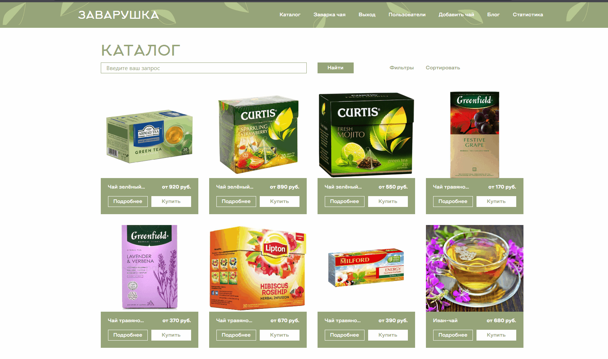
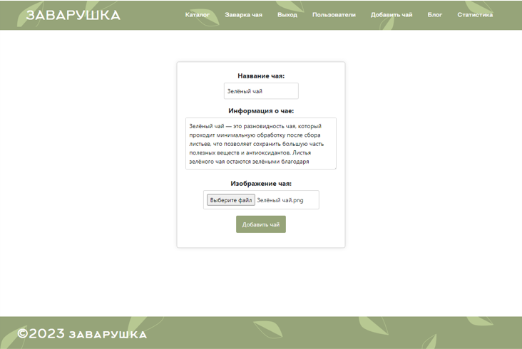
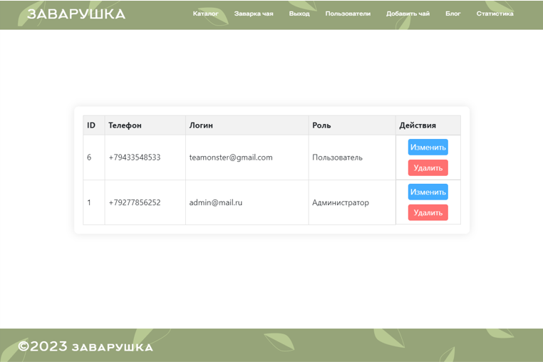
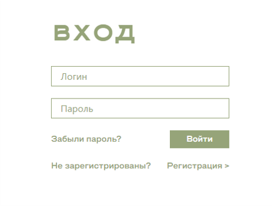
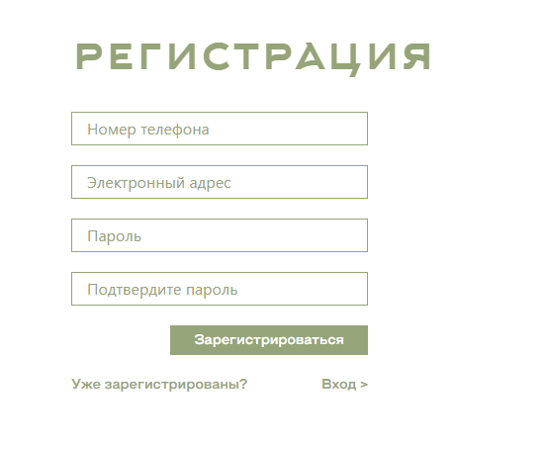
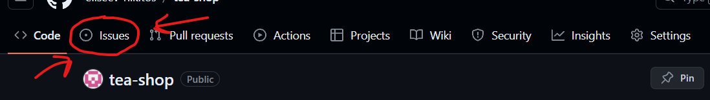
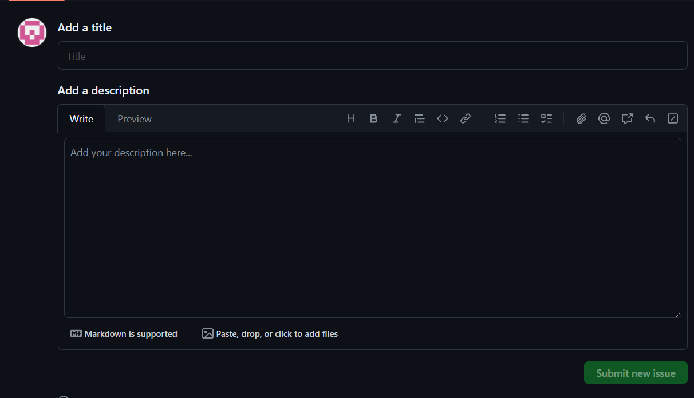

# Чайный магазин


 


[](https://github.com/eliseev-nikitos/tea-shop/releases)


---
Добро пожаловать в репозиторий чайного магазина! Этот проект создан для разработки и поддержки онлайн-магазина, специализирующегося на качественном чае.


## Технологии

Этот проект разрабатывается с использованием современных технологий веб-разработки, включая:

- Фронтенд: EJS, CSS, JavaScript
- Бэкенд: Node.js, Express.js
- ML: Python
- База данных: PostgreSQL

## Инструкции по установке

Замечание: предполагается, что имеются все файлы проекта, субд postgresql не ниже 15 версии, последняя стабильная версия python, последняя стабильная версия node.js.

1) Установить необходимые python библиотеки из requirements.txt

    ```
    pip install -r ./ml/requirements.txt
    ```

2) Установите необходимые зависимости для Node.js

    ```
    npm install
    ```

3) Создание базы данных

    Любым удобным способом выполнить скрипт находящийся в ```./config/database.sql```

4) Создать файл .env в папке ml/ и указать следующие данные для подключения к бд

    ```
    DB_HOST=

    DB_PORT=

    DB_USER=

    DB_PASSWORD=

    DB_NAME=
    ```
5) Также указать данные для бд в ```config/db.config.js```
6) Запустите приложение командой

    ```
    npm run start
    ```


## Примеры использования

На сайте присутсвует каталог, в катором можно при помощи умного поиска через ml найти любой чай, после подробно ознакомится с ним, узнать цену на нужный вес. Также прямо из старницы конкретного чая можно перейти к инструкции заварки чая!



Администратору доступны свои уникальные действия, такие как удаление/изменение/добавление чая. Вот так выглядит добавление: 



Также администратор может взаимодейстовать с зарегистрированными пользователями:



В свою очередь пользователи могу регистрироваться и входить в свои аккаунты:





## Вклад в разработку

Мы приветствуем вклад от сообщества! Если у вас есть идеи или предложения по улучшению проекта, пожалуйста, создайте новый issue или отправьте нам pull request. Мы рады сотрудничеству и стремимся сделать наш магазин лучше вместе с нашими клиентами.


*issue*: Для того, чтобы это сделать, перейдите во вкладку Issues в перхней части сайта.



Затем нажмите на кнопку <button style="background-color: green; color: white; border-radius: 5px; padding: 5px; font-size: 14; border:none;">New issue</button> , опишите свою проблему и отправьте её. Мы постараемся оперативно вам помочь или исправить ошибку в нашем коде.



## Лицензия

Этот проект лицензирован в соответствии с условиями лицензии [MIT](LICENSE.md).


## Автор

- **eliseev-nikitos**
  - GitHub: [eliseev-nikitos](https://github.com/eliseev-nikitos)
  - Электронная почта: kirpich.rylit@mail.ru

